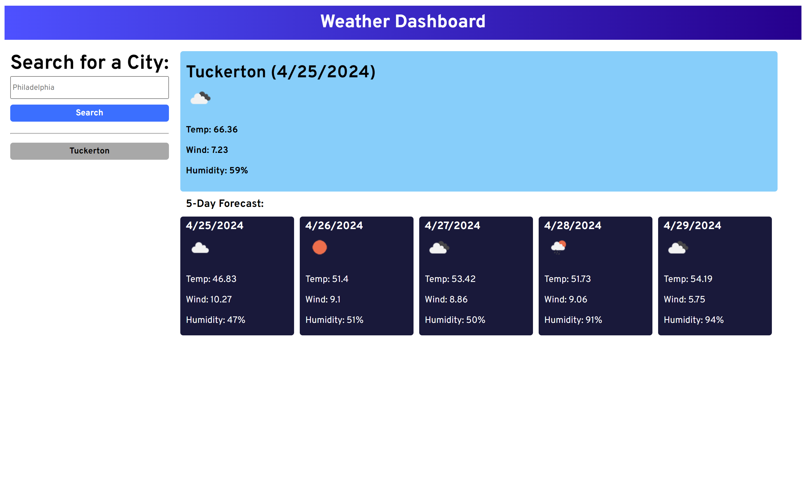

# Weather-Dashboard
https://mikedaleo.github.io/Weather-Dashboard/

## Description

A weather dashboard to see the weather forecast for the current day and upcoming 5 days.

## Usage 

To check the weather for the upcoming days.

## Credits
OpenWeather API was used to fetch the weather data.
https://openweathermap.org/forecast5

## License 

MIT License (Refer to the repo)